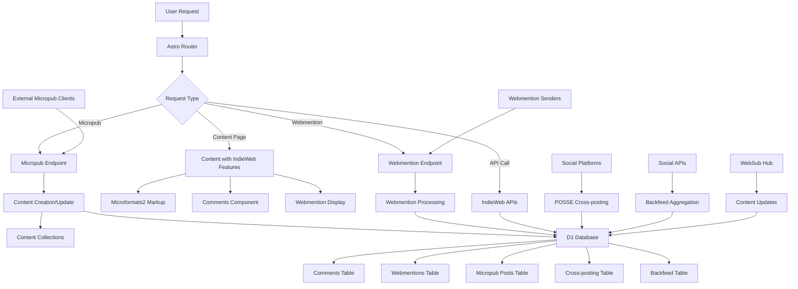

# Design Document

## Overview

This design document outlines the implementation of comprehensive IndieWeb standards and protocols for the Meteoric Teachings website. The solution integrates microformats2 markup, comment system with database storage, IndieWeb discovery links, webmention sending and receiving, Micropub endpoint with draft/update operations, WebSub integration, POSSE cross-posting to X/Twitter, Threads and dev.to, and backfeed aggregation while maintaining the existing Astro architecture with robust D1 database integration throughout.

## Architecture

### High-Level Architecture



### Component Architecture

The implementation extends the existing Astro architecture with:

1. **Microformats2 Integration**: Comprehensive h-entry, h-card markup with database validation tracking
2. **Comment System**: Full comment functionality with D1 database storage, captcha, and moderation
3. **IndieWeb Discovery**: Proper rel attributes and endpoint discovery with database configuration
4. **Webmention System**: Sending and receiving webmentions with database queue and processing
5. **Micropub Endpoint**: Content creation/update with database-backed draft operations
6. **WebSub Integration**: Real-time content distribution with database subscription tracking
7. **POSSE Cross-posting**: Automated syndication to X, Threads, dev.to with database logging
8. **Backfeed Aggregation**: Social comment collection with database storage and moderation
9. **Database Layer**: Comprehensive D1 tables for all IndieWeb features and operations

## Components and Interfaces

### 1. IndieWeb Integration System

#### Micropub Implementation
```typescript
interface MicropubRequest {
  type: string[];
  properties: {
    name?: string[];
    content?: string[];
    category?: string[];
    'published'?: string[];
    'mp-slug'?: string[];
  };
  action?: 'create' | 'update' | 'delete';
}

interface MicropubResponse {
  location?: string;
  error?: string;
  error_description?: string;
}
```

#### IndieAuth Configuration
```typescript
interface IndieAuthConfig {
  authorization_endpoint: string;
  token_endpoint: string;
  micropub_endpoint: string;
  webmention_endpoint: string;
}

interface IndieAuthToken {
  access_token: string;
  token_type: 'Bearer';
  scope: string;
  me: string;
}
```

#### Microformats Integration
```typescript
interface MicroformatsData {
  'h-entry': {
    name: string[];
    content: string[];
    published: string[];
    author: string[];
    category: string[];
    url: string[];
  };
}
```

### 2. Engagement System

#### Reactions System
```typescript
interface Reaction {
  id: string;
  content_id: string;
  content_type: string;
  reaction_type: 'like' | 'love' | 'bookmark';
  user_identifier: string; // IP hash or session ID
  timestamp: Date;
}

interface ReactionCounts {
  like: number;
  love: number;
  bookmark: number;
}

interface ReactionsConfig {
  enabled: boolean;
  allowed_types: string[];
  rate_limit: number;
}
```

#### Comments System
```typescript
interface Comment {
  id: string;
  content_id: string;
  content_type: string;
  author_name: string;
  author_email: string;
  content: string;
  timestamp: Date;
  approved: boolean;
  ip_address: string;
  user_agent: string;
}

interface CommentForm {
  name: string;
  email: string;
  content: string;
  captcha_token: string;
}

interface CommentsConfig {
  enabled: boolean;
  require_approval: boolean;
  captcha_provider: 'hcaptcha' | 'recaptcha';
  max_length: number;
}
```

### 3. Database Schema Design

#### D1 Database Tables
```sql
-- Comments table
CREATE TABLE comments (
  id INTEGER PRIMARY KEY AUTOINCREMENT,
  content_id TEXT NOT NULL,
  content_type TEXT NOT NULL,
  author_name TEXT NOT NULL,
  author_email TEXT NOT NULL,
  content TEXT NOT NULL,
  timestamp DATETIME DEFAULT CURRENT_TIMESTAMP,
  approved BOOLEAN DEFAULT FALSE,
  ip_address TEXT,
  user_agent TEXT,
  source_type TEXT DEFAULT 'direct' -- 'direct', 'backfeed_twitter', 'backfeed_threads', 'backfeed_devto'
);

-- Webmentions table
CREATE TABLE webmentions (
  id INTEGER PRIMARY KEY AUTOINCREMENT,
  source_url TEXT NOT NULL,
  target_url TEXT NOT NULL,
  content TEXT,
  author_name TEXT,
  author_url TEXT,
  mention_type TEXT, -- 'mention', 'like', 'repost', 'reply'
  timestamp DATETIME DEFAULT CURRENT_TIMESTAMP,
  verified BOOLEAN DEFAULT FALSE,
  approved BOOLEAN DEFAULT FALSE,
  processed BOOLEAN DEFAULT FALSE
);

-- Micropub posts table
CREATE TABLE micropub_posts (
  id INTEGER PRIMARY KEY AUTOINCREMENT,
  post_type TEXT NOT NULL,
  content_id TEXT,
  status TEXT DEFAULT 'draft', -- 'draft', 'published', 'deleted'
  properties TEXT, -- JSON string of micropub properties
  created_via TEXT DEFAULT 'micropub',
  timestamp DATETIME DEFAULT CURRENT_TIMESTAMP,
  last_modified DATETIME DEFAULT CURRENT_TIMESTAMP
);

-- Cross-posting syndication table
CREATE TABLE syndication (
  id INTEGER PRIMARY KEY AUTOINCREMENT,
  content_id TEXT NOT NULL,
  content_type TEXT NOT NULL,
  platform TEXT NOT NULL, -- 'twitter', 'threads', 'devto'
  syndication_url TEXT,
  status TEXT DEFAULT 'pending', -- 'pending', 'success', 'failed'
  error_message TEXT,
  timestamp DATETIME DEFAULT CURRENT_TIMESTAMP,
  retry_count INTEGER DEFAULT 0
);

-- WebSub subscriptions table
CREATE TABLE websub_subscriptions (
  id INTEGER PRIMARY KEY AUTOINCREMENT,
  hub_url TEXT NOT NULL,
  topic_url TEXT NOT NULL,
  callback_url TEXT,
  subscription_id TEXT,
  status TEXT DEFAULT 'pending', -- 'pending', 'active', 'expired'
  expires_at DATETIME,
  timestamp DATETIME DEFAULT CURRENT_TIMESTAMP
);

-- Microformats validation table
CREATE TABLE microformats_validation (
  id INTEGER PRIMARY KEY AUTOINCREMENT,
  content_id TEXT NOT NULL,
  content_type TEXT NOT NULL,
  validation_result TEXT, -- JSON string of validation results
  is_valid BOOLEAN DEFAULT FALSE,
  timestamp DATETIME DEFAULT CURRENT_TIMESTAMP
);

-- IndieWeb configuration table
CREATE TABLE indieweb_config (
  id INTEGER PRIMARY KEY AUTOINCREMENT,
  config_key TEXT NOT NULL UNIQUE,
  config_value TEXT NOT NULL,
  timestamp DATETIME DEFAULT CURRENT_TIMESTAMP
);

-- Backfeed tracking table
CREATE TABLE backfeed_tracking (
  id INTEGER PRIMARY KEY AUTOINCREMENT,
  content_id TEXT NOT NULL,
  platform TEXT NOT NULL, -- 'twitter', 'threads', 'devto'
  platform_post_id TEXT,
  last_checked DATETIME DEFAULT CURRENT_TIMESTAMP,
  status TEXT DEFAULT 'active' -- 'active', 'paused', 'completed'
);

-- Indexes for performance
CREATE INDEX idx_comments_content ON comments(content_id, content_type);
CREATE INDEX idx_comments_approved ON comments(approved);
CREATE INDEX idx_comments_source_type ON comments(source_type);
CREATE INDEX idx_webmentions_target ON webmentions(target_url);
CREATE INDEX idx_webmentions_verified ON webmentions(verified, approved);
CREATE INDEX idx_micropub_status ON micropub_posts(status);
CREATE INDEX idx_syndication_content ON syndication(content_id, content_type);
CREATE INDEX idx_syndication_platform ON syndication(platform, status);
CREATE INDEX idx_websub_status ON websub_subscriptions(status);
CREATE INDEX idx_microformats_content ON microformats_validation(content_id, content_type);
CREATE INDEX idx_backfeed_content ON backfeed_tracking(content_id, platform);
```

### 4. API Endpoints Design

#### Micropub Endpoint
```typescript
// src/pages/api/micropub.ts
export const POST: APIRoute = async ({ request, locals }) => {
  const contentType = request.headers.get('content-type');
  
  if (contentType?.includes('application/json')) {
    // JSON format
    const data = await request.json();
    return await processMicropubRequest(data, locals);
  } else {
    // Form-encoded format
    const formData = await request.formData();
    return await processMicropubForm(formData, locals);
  }
};

export const GET: APIRoute = async ({ url }) => {
  const q = url.searchParams.get('q');
  
  switch (q) {
    case 'config':
      return new Response(JSON.stringify({
        'media-endpoint': '/api/micropub/media',
        'syndicate-to': []
      }));
    case 'source':
      // Return source content
      break;
    default:
      return new Response('Invalid query', { status: 400 });
  }
};
```

#### Webmention API
```typescript
// src/pages/api/webmention.ts
export const POST: APIRoute = async ({ request, locals }) => {
  const formData = await request.formData();
  const source = formData.get('source') as string;
  const target = formData.get('target') as string;
  
  // Verify webmention
  const verification = await verifyWebmention(source, target);
  if (!verification.valid) {
    return new Response('Invalid webmention', { status: 400 });
  }
  
  // Store webmention in D1
  const result = await storeWebmention({
    source_url: source,
    target_url: target,
    content: verification.content,
    author_name: verification.author_name,
    author_url: verification.author_url,
    mention_type: verification.type
  }, locals.runtime.env.DB);
  
  return new Response('Webmention received', { status: 202 });
};

export const GET: APIRoute = async ({ url, locals }) => {
  const target = url.searchParams.get('target');
  
  if (target) {
    const webmentions = await getWebmentions(target, locals.runtime.env.DB);
    return new Response(JSON.stringify(webmentions));
  }
  
  return new Response('Target required', { status: 400 });
};
```

#### Comments API
```typescript
// src/pages/api/comments.ts
export const POST: APIRoute = async ({ request, locals }) => {
  const formData = await request.formData();
  const commentData = {
    content_id: formData.get('content_id'),
    content_type: formData.get('content_type'),
    author_name: formData.get('name'),
    author_email: formData.get('email'),
    content: formData.get('content'),
    captcha_token: formData.get('captcha_token'),
    source_type: 'direct'
  };
  
  // Verify captcha
  const captchaValid = await verifyCaptcha(commentData.captcha_token);
  if (!captchaValid) {
    return new Response(JSON.stringify({ error: 'Invalid captcha' }), { status: 400 });
  }
  
  // Store comment in D1 database
  const result = await storeComment(commentData, locals.runtime.env.DB);
  return new Response(JSON.stringify(result));
};

export const GET: APIRoute = async ({ url, locals }) => {
  const content_id = url.searchParams.get('content_id');
  const content_type = url.searchParams.get('content_type');
  
  // Get comments from database including backfed comments
  const comments = await getComments(content_id, content_type, locals.runtime.env.DB);
  return new Response(JSON.stringify(comments));
};
```

#### Cross-posting API
```typescript
// src/pages/api/syndicate.ts
export const POST: APIRoute = async ({ request, locals }) => {
  const { content_id, content_type, platforms } = await request.json();
  
  const results = [];
  
  for (const platform of platforms) {
    try {
      let syndicationUrl;
      
      switch (platform) {
        case 'twitter':
          syndicationUrl = await crossPostToTwitter(content_id, content_type);
          break;
        case 'threads':
          syndicationUrl = await crossPostToThreads(content_id, content_type);
          break;
        case 'devto':
          syndicationUrl = await crossPostToDevTo(content_id, content_type);
          break;
      }
      
      // Store syndication result in database
      await storeSyndication({
        content_id,
        content_type,
        platform,
        syndication_url: syndicationUrl,
        status: 'success'
      }, locals.runtime.env.DB);
      
      results.push({ platform, status: 'success', url: syndicationUrl });
    } catch (error) {
      // Store failed syndication in database
      await storeSyndication({
        content_id,
        content_type,
        platform,
        status: 'failed',
        error_message: error.message
      }, locals.runtime.env.DB);
      
      results.push({ platform, status: 'failed', error: error.message });
    }
  }
  
  return new Response(JSON.stringify(results));
};
```

#### Backfeed API
```typescript
// src/pages/api/backfeed.ts
export const POST: APIRoute = async ({ request, locals }) => {
  const { content_id, platforms } = await request.json();
  
  const results = [];
  
  for (const platform of platforms) {
    try {
      let comments;
      
      switch (platform) {
        case 'twitter':
          comments = await fetchTwitterComments(content_id);
          break;
        case 'threads':
          comments = await fetchThreadsComments(content_id);
          break;
        case 'devto':
          comments = await fetchDevToComments(content_id);
          break;
      }
      
      // Store backfed comments in database
      for (const comment of comments) {
        await storeComment({
          ...comment,
          source_type: `backfeed_${platform}`
        }, locals.runtime.env.DB);
      }
      
      results.push({ platform, status: 'success', count: comments.length });
    } catch (error) {
      results.push({ platform, status: 'failed', error: error.message });
    }
  }
  
  return new Response(JSON.stringify(results));
};
```

### 5. Component Design

#### Microformats2 Markup Component
```astro
---
// src/components/MicroformatsEntry.astro
interface Props {
  title: string;
  content: string;
  published: Date;
  author: {
    name: string;
    url: string;
    photo?: string;
  };
  url: string;
  categories?: string[];
  syndication?: string[];
}

const { title, content, published, author, url, categories = [], syndication = [] } = Astro.props;
---

<article class="h-entry">
  <h1 class="p-name">{title}</h1>
  
  <div class="entry-meta">
    <div class="h-card p-author">
      {author.photo && }
      <a class="p-name u-url" href={author.url}>{author.name}</a>
    </div>
    <time class="dt-published" datetime={published.toISOString()}>
      {published.toLocaleDateString()}
    </time>
  </div>
  
  <div class="e-content">
    <slot />
  </div>
  
  {categories.length > 0 && (
    <div class="entry-categories">
      {categories.map(category => (
        <span class="p-category">{category}</span>
      ))}
    </div>
  )}
  
  {syndication.length > 0 && (
    <div class="entry-syndication">
      <span>Also posted on:</span>
      {syndication.map(url => (
        <a class="u-syndication" href={url} rel="syndication">
          {new URL(url).hostname}
        </a>
      ))}
    </div>
  )}
  
  <a class="u-url" href={url} style="display: none;">{url}</a>
</article>
```

#### Enhanced Comments Component with Backfeed
```astro
---
// src/components/Comments.astro
interface Props {
  contentId: string;
  contentType: string;
  enabled?: boolean;
}

const { contentId, contentType, enabled = true } = Astro.props;

// Fetch existing comments including backfed comments from database
const comments = enabled ? await getCommentsWithBackfeed(contentId, contentType) : [];
const webmentions = enabled ? await getWebmentions(contentId, contentType) : [];
---

{enabled && (
  <div class="comments-section">
    <h3>Comments & Interactions</h3>
    
    <!-- Comment Form -->
    <form class="comment-form" data-content-id={contentId} data-content-type={contentType}>
      <div class="form-group">
        <label for="name">Name *</label>
        <input type="text" id="name" name="name" required />
      </div>
      <div class="form-group">
        <label for="email">Email *</label>
        <input type="email" id="email" name="email" required />
      </div>
      <div class="form-group">
        <label for="content">Comment *</label>
        <textarea id="content" name="content" required></textarea>
      </div>
      <div class="captcha-container">
        <!-- Captcha will be inserted here -->
      </div>
      <button type="submit">Post Comment</button>
    </form>
    
    <!-- Webmentions -->
    {webmentions.length > 0 && (
      <div class="webmentions-section">
        <h4>Webmentions</h4>
        <div class="webmentions-list">
          {webmentions.map(mention => (
            <div class="h-cite webmention" data-type={mention.mention_type}>
              <div class="webmention-header">
                <a class="p-author h-card" href={mention.author_url}>
                  {mention.author_name}
                </a>
                <span class="webmention-type">{mention.mention_type}</span>
                <time class="dt-published">{new Date(mention.timestamp).toLocaleDateString()}</time>
              </div>
              {mention.content && (
                <div class="p-content webmention-content">{mention.content}</div>
              )}
              <a class="u-url" href={mention.source_url}>View original</a>
            </div>
          ))}
        </div>
      </div>
    )}
    
    <!-- Direct and Backfed Comments -->
    <div class="comments-list">
      {comments.map(comment => (
        <div class="h-cite comment" data-source={comment.source_type}>
          <div class="comment-header">
            <strong class="p-author">{comment.author_name}</strong>
            <time class="dt-published">{new Date(comment.timestamp).toLocaleDateString()}</time>
            {comment.source_type !== 'direct' && (
              <span class="comment-source">via {comment.source_type.replace('backfeed_', '')}</span>
            )}
          </div>
          <div class="p-content comment-content">{comment.content}</div>
        </div>
      ))}
    </div>
  </div>
)}

<script>
  // Enhanced comment handling with backfeed support
  document.addEventListener('DOMContentLoaded', () => {
    initializeComments();
    initializeWebmentionDisplay();
  });
</script>
```

#### Webmention Display Component
```astro
---
// src/components/WebmentionDisplay.astro
interface Props {
  targetUrl: string;
  showForm?: boolean;
}

const { targetUrl, showForm = false } = Astro.props;

// Fetch webmentions for this URL from database
const webmentions = await getWebmentionsByTarget(targetUrl);
const groupedMentions = groupWebmentionsByType(webmentions);
---

<div class="webmention-display">
  {Object.keys(groupedMentions).length > 0 && (
    <div class="webmention-summary">
      {groupedMentions.likes?.length > 0 && (
        <span class="webmention-count">
          {groupedMentions.likes.length} likes
        </span>
      )}
      {groupedMentions.reposts?.length > 0 && (
        <span class="webmention-count">
          {groupedMentions.reposts.length} reposts
        </span>
      )}
      {groupedMentions.replies?.length > 0 && (
        <span class="webmention-count">
          {groupedMentions.replies.length} replies
        </span>
      )}
    </div>
  )}
  
  {showForm && (
    <form class="webmention-form" action="/api/webmention" method="post">
      <input type="hidden" name="target" value={targetUrl} />
      <div class="form-group">
        <label for="source">Send a webmention from:</label>
        <input type="url" id="source" name="source" placeholder="https://example.com/your-post" required />
      </div>
      <button type="submit">Send Webmention</button>
    </form>
  )}
</div>
```

### 6. Cross-posting and Syndication

#### POSSE Implementation
```typescript
interface CrossPostingConfig {
  twitter: {
    api_key: string;
    api_secret: string;
    access_token: string;
    access_token_secret: string;
    enabled: boolean;
  };
  threads: {
    access_token: string;
    enabled: boolean;
  };
  devto: {
    api_key: string;
    enabled: boolean;
  };
}

interface SyndicationResult {
  platform: string;
  status: 'success' | 'failed';
  syndication_url?: string;
  error_message?: string;
  timestamp: Date;
}
```

#### Backfeed Configuration
```typescript
interface BackfeedConfig {
  twitter: {
    enabled: boolean;
    check_interval: number; // minutes
    max_age: number; // days
  };
  threads: {
    enabled: boolean;
    check_interval: number;
    max_age: number;
  };
  devto: {
    enabled: boolean;
    check_interval: number;
    max_age: number;
  };
}

interface BackfeedComment {
  platform_id: string;
  author_name: string;
  author_url?: string;
  content: string;
  timestamp: Date;
  platform_url: string;
}
```

## Data Models

### 1. IndieWeb Post Model
```typescript
interface IndieWebPost {
  type: string[];
  properties: {
    name?: string[];
    content?: string[];
    published?: string[];
    category?: string[];
    syndication?: string[];
    'mp-slug'?: string[];
  };
  url: string;
  created_via: 'micropub' | 'manual';
  status: 'draft' | 'published' | 'deleted';
}
```

### 2. Webmention Model
```typescript
interface Webmention {
  id: string;
  source_url: string;
  target_url: string;
  content?: string;
  author_name?: string;
  author_url?: string;
  mention_type: 'mention' | 'like' | 'repost' | 'reply';
  verified: boolean;
  approved: boolean;
  timestamp: Date;
}
```

### 3. Comment Model with Backfeed
```typescript
interface Comment {
  id: string;
  content_id: string;
  content_type: string;
  author_name: string;
  author_email?: string;
  content: string;
  timestamp: Date;
  approved: boolean;
  source_type: 'direct' | 'backfeed_twitter' | 'backfeed_threads' | 'backfeed_devto';
  platform_url?: string;
  ip_address?: string;
}
```

### 4. Syndication Model
```typescript
interface Syndication {
  id: string;
  content_id: string;
  content_type: string;
  platform: 'twitter' | 'threads' | 'devto';
  syndication_url?: string;
  status: 'pending' | 'success' | 'failed';
  error_message?: string;
  timestamp: Date;
  retry_count: number;
}
```

## Error Handling

### 1. API Error Handling
```typescript
interface APIError {
  error: string;
  error_description?: string;
  status_code: number;
  timestamp: Date;
}

// Standardized error responses
const ErrorResponses = {
  INVALID_TOKEN: { error: 'invalid_token', status: 401 },
  INSUFFICIENT_SCOPE: { error: 'insufficient_scope', status: 403 },
  INVALID_REQUEST: { error: 'invalid_request', status: 400 },
  SERVER_ERROR: { error: 'server_error', status: 500 }
};
```

### 2. Database Error Handling
```typescript
interface DatabaseError {
  code: string;
  message: string;
  query?: string;
  table: string;
}

// Fallback strategies
const ErrorFallbacks = {
  COMMENTS_UNAVAILABLE: 'Show message about temporary unavailability',
  WEBMENTIONS_UNAVAILABLE: 'Hide webmention section gracefully',
  MICROPUB_FAILED: 'Return error to client with retry suggestion',
  SYNDICATION_FAILED: 'Log error and schedule retry',
  BACKFEED_FAILED: 'Continue with existing comments'
};
```

### 3. Webmention Error Handling
```typescript
interface WebmentionError {
  type: 'verification_failed' | 'invalid_source' | 'network_error';
  source_url: string;
  target_url: string;
  error_message: string;
  retry_count: number;
}
```

### 4. Cross-posting Error Handling
```typescript
interface CrossPostingError {
  platform: string;
  content_id: string;
  error_type: 'auth_failed' | 'rate_limited' | 'content_rejected' | 'network_error';
  error_message: string;
  retry_after?: number;
  permanent_failure: boolean;
}
```

## Testing Strategy

### 1. IndieWeb Compliance Testing
- **Micropub Endpoint**: Test with various Micropub clients (Quill, Indigenous, etc.)
- **IndieAuth**: Verify authentication flow and token management
- **Microformats**: Validate markup with microformats2 parser and database tracking
- **Webmentions**: Test sending and receiving with verification and database storage
- **Discovery Links**: Verify all rel attributes and endpoint discovery

### 2. Comment System Testing
- **Direct Comments**: Test form validation, captcha, database storage, and moderation
- **Backfeed Comments**: Test aggregation from Twitter, Threads, and dev.to
- **Comment Display**: Test unified display of direct and backfed comments
- **Database Operations**: Test concurrent access, data integrity, and performance

### 3. Cross-posting and Syndication Testing
- **POSSE Implementation**: Test cross-posting to all platforms with database tracking
- **Syndication URLs**: Verify proper storage and display of syndication links
- **Error Handling**: Test retry mechanisms and error logging
- **Rate Limiting**: Test platform-specific rate limits and backoff strategies

### 4. Database and Performance Testing
- **Database Schema**: Test all table operations, indexes, and constraints
- **API Performance**: Ensure fast response times for all IndieWeb endpoints
- **Concurrent Operations**: Test multiple simultaneous webmentions, comments, and syndication
- **Data Integrity**: Verify referential integrity and transaction handling

### 5. Security Testing
- **Input Validation**: Test all form inputs and API endpoints for security
- **Authentication**: Test IndieAuth security and token validation
- **Webmention Verification**: Test source verification and spam prevention
- **Database Security**: Test SQL injection prevention and access controls

## Implementation Phases

### Phase 1: Foundation & Core IndieWeb Features
1. Comprehensive D1 database schema creation for all IndieWeb features
2. Microformats2 markup implementation with database validation tracking
3. Comment system with database storage, captcha, and moderation
4. IndieWeb discovery links and endpoint configuration

### Phase 2: Webmention System
1. Webmention sending system with database queue and tracking
2. Webmention receiving endpoint with verification and database storage
3. Webmention display integration with database-backed moderation
4. Webmention processing and notification system

### Phase 3: Micropub and Content Management
1. Micropub endpoint implementation with database-backed authentication
2. Draft and update operations with database state management
3. Content creation integration with existing collections
4. Micropub client testing and validation

### Phase 4: Cross-posting and Syndication
1. POSSE implementation for Twitter, Threads, and dev.to with database tracking
2. Syndication URL storage and display system
3. Cross-posting error handling and retry mechanisms
4. WebSub integration for real-time content distribution

### Phase 5: Backfeed and Aggregation
1. Social platform API integration for comment backfeed
2. Backfeed comment aggregation with database storage
3. Unified comment display system for direct and backfed comments
4. Backfeed moderation and management tools

### Phase 6: Testing, Security, and Optimization
1. Comprehensive IndieWeb compliance testing
2. Database performance optimization and security hardening
3. Cross-platform integration testing
4. Documentation and maintenance procedures

This design provides a comprehensive foundation for implementing all 9 core IndieWeb features with robust database integration throughout the system.