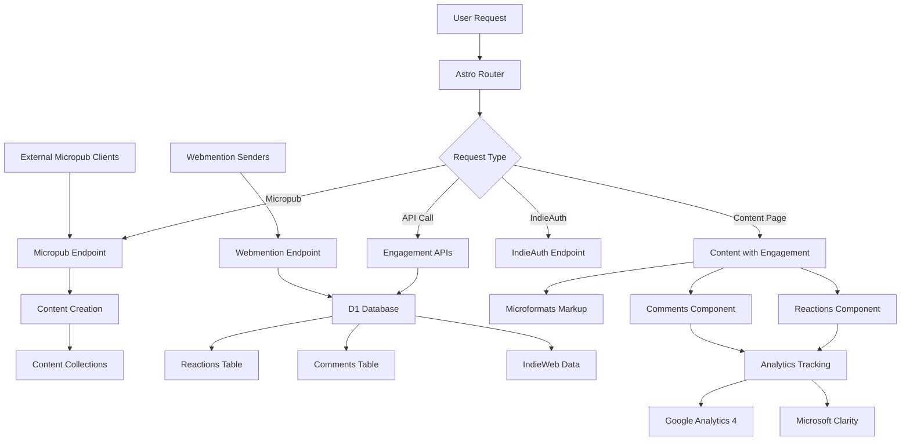

# Design Document

## Overview

This design document outlines the implementation of comprehensive IndieWeb standards, interactive engagement systems, and performance optimizations for the Meteoric Teachings website. The solution integrates OpenWeb/Micropub protocols, content reactions, custom comments system, analytics tracking, and performance enhancements while maintaining the existing Astro architecture.

## Architecture

### High-Level Architecture



### Component Architecture

The implementation extends the existing Astro architecture with:

1. **IndieWeb Integration**: Micropub, IndieAuth, and Webmention endpoints
2. **Engagement Components**: Reactions and comments with D1 storage
3. **Analytics Enhancement**: GA4 and Clarity with engagement tracking
4. **Performance Optimization**: Resource hints and loading optimization
5. **Database Layer**: D1 tables for all interactive features

## Components and Interfaces

### 1. IndieWeb Integration System

#### Micropub Implementation
```typescript
interface MicropubRequest {
  type: string[];
  properties: {
    name?: string[];
    content?: string[];
    category?: string[];
    'published'?: string[];
    'mp-slug'?: string[];
  };
  action?: 'create' | 'update' | 'delete';
}

interface MicropubResponse {
  location?: string;
  error?: string;
  error_description?: string;
}
```

#### IndieAuth Configuration
```typescript
interface IndieAuthConfig {
  authorization_endpoint: string;
  token_endpoint: string;
  micropub_endpoint: string;
  webmention_endpoint: string;
}

interface IndieAuthToken {
  access_token: string;
  token_type: 'Bearer';
  scope: string;
  me: string;
}
```

#### Microformats Integration
```typescript
interface MicroformatsData {
  'h-entry': {
    name: string[];
    content: string[];
    published: string[];
    author: string[];
    category: string[];
    url: string[];
  };
}
```

### 2. Engagement System

#### Reactions System
```typescript
interface Reaction {
  id: string;
  content_id: string;
  content_type: string;
  reaction_type: 'like' | 'love' | 'bookmark';
  user_identifier: string; // IP hash or session ID
  timestamp: Date;
}

interface ReactionCounts {
  like: number;
  love: number;
  bookmark: number;
}

interface ReactionsConfig {
  enabled: boolean;
  allowed_types: string[];
  rate_limit: number;
}
```

#### Comments System
```typescript
interface Comment {
  id: string;
  content_id: string;
  content_type: string;
  author_name: string;
  author_email: string;
  content: string;
  timestamp: Date;
  approved: boolean;
  ip_address: string;
  user_agent: string;
}

interface CommentForm {
  name: string;
  email: string;
  content: string;
  captcha_token: string;
}

interface CommentsConfig {
  enabled: boolean;
  require_approval: boolean;
  captcha_provider: 'hcaptcha' | 'recaptcha';
  max_length: number;
}
```

### 3. Database Schema Design

#### D1 Database Tables
```sql
-- Reactions table
CREATE TABLE reactions (
  id INTEGER PRIMARY KEY AUTOINCREMENT,
  content_id TEXT NOT NULL,
  content_type TEXT NOT NULL,
  reaction_type TEXT NOT NULL CHECK (reaction_type IN ('like', 'love', 'bookmark')),
  user_identifier TEXT NOT NULL,
  timestamp DATETIME DEFAULT CURRENT_TIMESTAMP,
  UNIQUE(content_id, content_type, reaction_type, user_identifier)
);

-- Comments table
CREATE TABLE comments (
  id INTEGER PRIMARY KEY AUTOINCREMENT,
  content_id TEXT NOT NULL,
  content_type TEXT NOT NULL,
  author_name TEXT NOT NULL,
  author_email TEXT NOT NULL,
  content TEXT NOT NULL,
  timestamp DATETIME DEFAULT CURRENT_TIMESTAMP,
  approved BOOLEAN DEFAULT FALSE,
  ip_address TEXT,
  user_agent TEXT
);

-- IndieWeb data table
CREATE TABLE indieweb_data (
  id INTEGER PRIMARY KEY AUTOINCREMENT,
  type TEXT NOT NULL, -- 'webmention', 'micropub_post', etc.
  source_url TEXT,
  target_url TEXT,
  content TEXT,
  timestamp DATETIME DEFAULT CURRENT_TIMESTAMP,
  processed BOOLEAN DEFAULT FALSE
);

-- Indexes for performance
CREATE INDEX idx_reactions_content ON reactions(content_id, content_type);
CREATE INDEX idx_reactions_type ON reactions(reaction_type);
CREATE INDEX idx_comments_content ON comments(content_id, content_type);
CREATE INDEX idx_comments_approved ON comments(approved);
CREATE INDEX idx_indieweb_type ON indieweb_data(type);
CREATE INDEX idx_indieweb_processed ON indieweb_data(processed);
```

### 4. API Endpoints Design

#### Micropub Endpoint
```typescript
// src/pages/api/micropub.ts
export const POST: APIRoute = async ({ request, locals }) => {
  const contentType = request.headers.get('content-type');
  
  if (contentType?.includes('application/json')) {
    // JSON format
    const data = await request.json();
    return await processMicropubRequest(data, locals);
  } else {
    // Form-encoded format
    const formData = await request.formData();
    return await processMicropubForm(formData, locals);
  }
};

export const GET: APIRoute = async ({ url }) => {
  const q = url.searchParams.get('q');
  
  switch (q) {
    case 'config':
      return new Response(JSON.stringify({
        'media-endpoint': '/api/micropub/media',
        'syndicate-to': []
      }));
    case 'source':
      // Return source content
      break;
    default:
      return new Response('Invalid query', { status: 400 });
  }
};
```

#### Reactions API
```typescript
// src/pages/api/reactions.ts
export const POST: APIRoute = async ({ request, locals }) => {
  const { content_id, content_type, reaction_type } = await request.json();
  const user_identifier = await generateUserIdentifier(request);
  
  // Store reaction in D1
  const result = await storeReaction({
    content_id,
    content_type,
    reaction_type,
    user_identifier
  }, locals.runtime.env.DB);
  
  return new Response(JSON.stringify(result));
};

export const GET: APIRoute = async ({ url, locals }) => {
  const content_id = url.searchParams.get('content_id');
  const content_type = url.searchParams.get('content_type');
  
  const counts = await getReactionCounts(content_id, content_type, locals.runtime.env.DB);
  return new Response(JSON.stringify(counts));
};
```

#### Comments API
```typescript
// src/pages/api/comments.ts
export const POST: APIRoute = async ({ request, locals }) => {
  const formData = await request.formData();
  const commentData = {
    content_id: formData.get('content_id'),
    content_type: formData.get('content_type'),
    author_name: formData.get('name'),
    author_email: formData.get('email'),
    content: formData.get('content'),
    captcha_token: formData.get('captcha_token')
  };
  
  // Verify captcha
  const captchaValid = await verifyCaptcha(commentData.captcha_token);
  if (!captchaValid) {
    return new Response(JSON.stringify({ error: 'Invalid captcha' }), { status: 400 });
  }
  
  // Store comment
  const result = await storeComment(commentData, locals.runtime.env.DB);
  return new Response(JSON.stringify(result));
};
```

### 5. Component Design

#### Reactions Component
```astro
---
// src/components/Reactions.astro
interface Props {
  contentId: string;
  contentType: string;
  enabled?: boolean;
}

const { contentId, contentType, enabled = true } = Astro.props;
---

{enabled && (
  <div class="reactions-container" data-content-id={contentId} data-content-type={contentType}>
    <button class="reaction-btn" data-reaction="like">
      <span class="reaction-icon">👍</span>
      <span class="reaction-count" data-reaction="like">0</span>
    </button>
    <button class="reaction-btn" data-reaction="love">
      <span class="reaction-icon">❤️</span>
      <span class="reaction-count" data-reaction="love">0</span>
    </button>
    <button class="reaction-btn" data-reaction="bookmark">
      <span class="reaction-icon">🔖</span>
      <span class="reaction-count" data-reaction="bookmark">0</span>
    </button>
  </div>
)}

<script>
  // Client-side reaction handling
  document.addEventListener('DOMContentLoaded', () => {
    initializeReactions();
  });
</script>
```

#### Comments Component
```astro
---
// src/components/Comments.astro
interface Props {
  contentId: string;
  contentType: string;
  enabled?: boolean;
}

const { contentId, contentType, enabled = true } = Astro.props;

// Fetch existing comments
const comments = enabled ? await getComments(contentId, contentType) : [];
---

{enabled && (
  <div class="comments-section">
    <h3>Comments</h3>
    
    <!-- Comment Form -->
    <form class="comment-form" data-content-id={contentId} data-content-type={contentType}>
      <div class="form-group">
        <label for="name">Name *</label>
        <input type="text" id="name" name="name" required />
      </div>
      <div class="form-group">
        <label for="email">Email *</label>
        <input type="email" id="email" name="email" required />
      </div>
      <div class="form-group">
        <label for="content">Comment *</label>
        <textarea id="content" name="content" required></textarea>
      </div>
      <div class="captcha-container">
        <!-- Captcha will be inserted here -->
      </div>
      <button type="submit">Post Comment</button>
    </form>
    
    <!-- Existing Comments -->
    <div class="comments-list">
      {comments.map(comment => (
        <div class="comment">
          <div class="comment-header">
            <strong>{comment.author_name}</strong>
            <time>{new Date(comment.timestamp).toLocaleDateString()}</time>
          </div>
          <div class="comment-content">{comment.content}</div>
        </div>
      ))}
    </div>
  </div>
)}
```

### 6. Analytics Integration

#### Enhanced Analytics Tracking
```typescript
interface EngagementEvent {
  event_name: 'reaction_click' | 'comment_submit' | 'micropub_create';
  event_parameters: {
    content_id: string;
    content_type: string;
    reaction_type?: string;
    engagement_type: string;
  };
}

interface AnalyticsConfig {
  ga4_measurement_id: string;
  clarity_project_id: string;
  track_engagement: boolean;
  track_indieweb: boolean;
}
```

#### Performance Tracking
```typescript
interface PerformanceMetrics {
  page_load_time: number;
  first_contentful_paint: number;
  largest_contentful_paint: number;
  cumulative_layout_shift: number;
  first_input_delay: number;
}
```

## Data Models

### 1. Content Engagement Model
```typescript
interface ContentEngagement {
  content_id: string;
  content_type: string;
  reactions: ReactionCounts;
  comment_count: number;
  engagement_score: number;
  last_activity: Date;
}
```

### 2. IndieWeb Post Model
```typescript
interface IndieWebPost {
  type: string[];
  properties: {
    name?: string[];
    content?: string[];
    published?: string[];
    category?: string[];
    syndication?: string[];
  };
  url: string;
  created_via: 'micropub' | 'manual';
}
```

### 3. User Engagement Model
```typescript
interface UserEngagement {
  user_identifier: string;
  total_reactions: number;
  total_comments: number;
  favorite_content_types: string[];
  last_activity: Date;
}
```

## Error Handling

### 1. API Error Handling
```typescript
interface APIError {
  error: string;
  error_description?: string;
  status_code: number;
  timestamp: Date;
}

// Standardized error responses
const ErrorResponses = {
  INVALID_TOKEN: { error: 'invalid_token', status: 401 },
  INSUFFICIENT_SCOPE: { error: 'insufficient_scope', status: 403 },
  INVALID_REQUEST: { error: 'invalid_request', status: 400 },
  SERVER_ERROR: { error: 'server_error', status: 500 }
};
```

### 2. Database Error Handling
```typescript
interface DatabaseError {
  code: string;
  message: string;
  query?: string;
  table: string;
}

// Fallback strategies
const ErrorFallbacks = {
  REACTIONS_UNAVAILABLE: 'Show static reaction counts',
  COMMENTS_UNAVAILABLE: 'Show message about temporary unavailability',
  MICROPUB_FAILED: 'Return error to client with retry suggestion'
};
```

### 3. Captcha Error Handling
```typescript
interface CaptchaError {
  provider: 'hcaptcha' | 'recaptcha';
  error_code: string;
  user_message: string;
}
```

## Testing Strategy

### 1. IndieWeb Compliance Testing
- **Micropub Endpoint**: Test with various Micropub clients
- **IndieAuth**: Verify authentication flow
- **Microformats**: Validate markup with microformats parser
- **Webmentions**: Test sending and receiving

### 2. Engagement System Testing
- **Reactions**: Test rate limiting, duplicate prevention, counting
- **Comments**: Test form validation, captcha, moderation
- **Database**: Test concurrent access, data integrity
- **Analytics**: Verify event tracking and data collection

### 3. Performance Testing
- **Resource Loading**: Test DNS prefetch, preconnect, preload
- **Core Web Vitals**: Monitor impact of new features
- **Database Performance**: Test query optimization
- **API Response Times**: Ensure fast engagement interactions

### 4. Security Testing
- **Input Validation**: Test all form inputs and API endpoints
- **Rate Limiting**: Test abuse prevention
- **Captcha**: Test spam prevention
- **Authentication**: Test IndieAuth security

## Implementation Phases

### Phase 1: Foundation & Database
1. D1 database schema creation
2. Basic API endpoints for reactions and comments
3. Analytics integration (GA4 + Clarity)
4. Performance optimization (resource hints)

### Phase 2: Engagement Features
1. Reactions component and functionality
2. Comments system with captcha
3. Content collection configuration
4. Moderation interface

### Phase 3: IndieWeb Integration
1. Micropub endpoint implementation
2. IndieAuth authentication
3. Microformats markup integration
4. Webmention handling

### Phase 4: Testing & Optimization
1. Comprehensive testing across all features
2. Performance optimization and monitoring
3. Security hardening
4. Documentation and maintenance guides

This design provides a comprehensive foundation for implementing all IndieWeb and engagement requirements while maintaining performance and security standards.