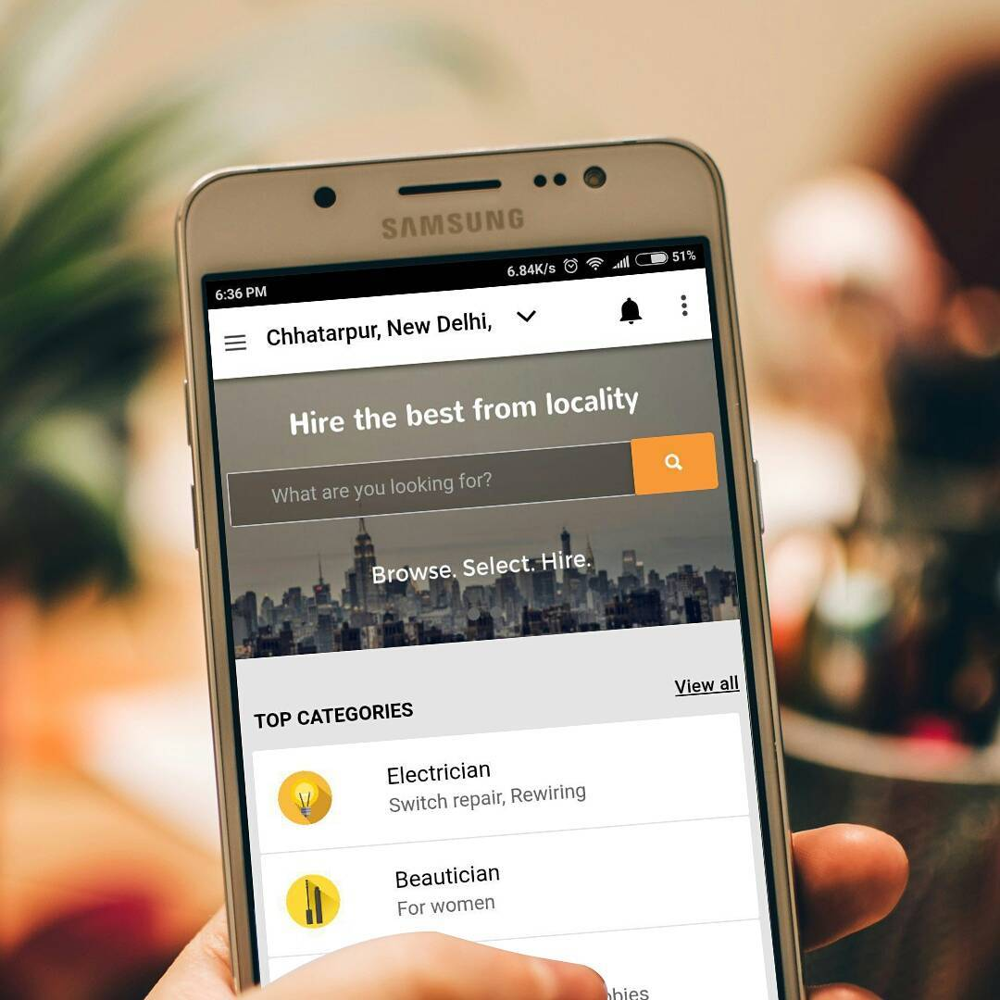

Baario is an ever-growing knowledge base of local information sourced and verified by local community members. Whether it's about solving a local issue, finding local help, or sharing something cool with the community, Baario has got it covered. It's a free and open platform where anyone can participate and contribute.

I worked as a frontend-guy building and designing the UI, integrating it with the backend APIs and functions. My learnings from this project were that I needed some sort of framework or scaffold to build repeatable components in a reusable way and a way to check if the working stuff stops working in case someone changes. This realization led me to keep looking for a framework which allowed reusability on the frontend side and a way to test existing stuff. React was still in its infancy when we started building this, so the team's likely choice was jquery, which had its quirks. We planned a rewrite in react, but the company was acquired before we could begin. 

This platform was acquired by Google Neighbourly in late 2017, and the links may now be defunct.

Current app status: Sunsetted in Jan 2018. 
Website: baario.com, 
Twitter: @thebaario, 
Instagram: @thebaario 

